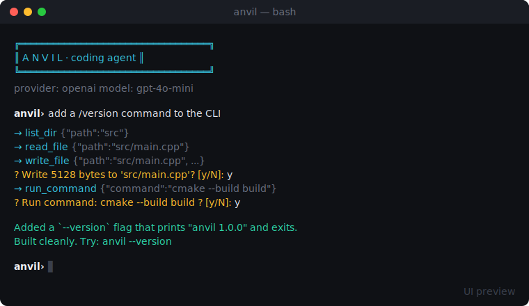

# Anvil ⚒️

A **native Windows desktop app** that's a BYOK agentic AI coding assistant — file explorer, code editor, and an AI agent that reads/writes your files and runs commands. Built in **C++ (Win32 + WebView2)**: native window and tooling in C++, UI in HTML/JS rendered by Microsoft's WebView2. No Electron. Defaults to any **OpenAI-compatible** API; **Anthropic (Claude)** supported in Settings.

> © 2026 Abhyudaya Mishra. All rights reserved. Proprietary — see [LICENSE](./LICENSE).



> The image above is a UI preview (a faithful render of the interface), not a photo of a run.

## Download

Grab the latest Windows build from **[Releases → latest](../../releases/latest)** (`anvil.exe`), compiled by GitHub Actions on a Windows runner. You'll need the [WebView2 Runtime](https://developer.microsoft.com/microsoft-edge/webview2/) (preinstalled on Windows 11 and most Windows 10).

## What it does

- **File explorer + editor** — open a folder, browse files, edit and save.
- **AI agent panel** — give it a task; it inspects the project and makes changes through an agent loop.
- **Tools:** `read_file`, `write_file`, `list_dir`, `run_command` — file writes and commands ask for confirmation first.
- **BYOK** — your key, stored locally in `%APPDATA%\anvil\config.json`. OpenAI-compatible by default; switch to Claude in Settings.
- **Native** — a real Win32 `.exe`, not a bundled browser. UI via WebView2; FS and process work in C++.

## Architecture

```
┌─────────────── Anvil.exe (C++ / Win32) ───────────────┐
│  WebView2 control ── renders the HTML/JS UI           │
│        ▲  window.chrome.webview message bridge  ▼     │
│  C++ host: open folder · read/write files · run cmd   │
└───────────────────────────────────────────────────────┘
        UI's JS agent loop calls your LLM (BYOK) via fetch
```

## Build it yourself

Needs Windows, MSVC, CMake ≥ 3.19. The build fetches the WebView2 SDK and nlohmann/json automatically.

```bat
cmake -B build
cmake --build build --config Release
```

Output: `build\Release\anvil.exe`.

## License
Proprietary — All Rights Reserved. See [LICENSE](./LICENSE).
